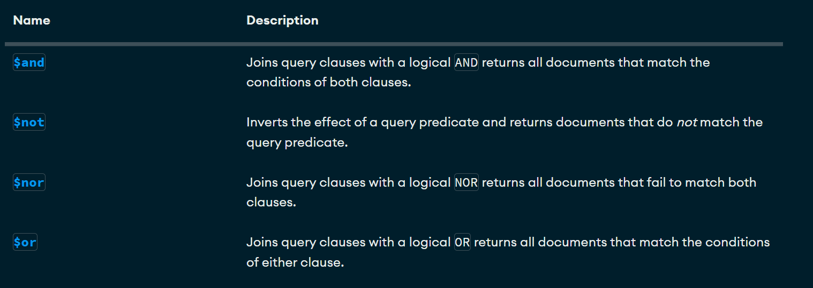

# Crud y consultas en MongoDB

## Crear una Base de Datos
Solo se crea si contiene por lo menos una 
colección

**use bd1** 

## Como crear una coleccion
use bd1
db.createCollection("Empleado")
        
## Mostrar las colecciones 
show collections

## Insertar un Documento
```json
db.alumnos.insertOne(
{
   nombre: 'Soyla',
   apellido1: 'Vaca',
   edad: 32,
   ciudad: 'San Miguel de las Piedras'
}
)
```

## Inserción de un documento mas complejo con array

```json
db.alumnos.insertOne(
{
  nombre: "Joquin",
apellido: "Dorian",
apellido2: "Guerrero",
edad: 15,
aficiones: [ 'Cerveza', 'Hueva',"Canabis"]
})
```

## Inserción de documentos mas complejos con documentos anidados y ID

``` json
db.alumnos.insertOne(
{
      nombre: 'Jose Luis',
      apellido1: "Herrera",
      apellido2: "Gallardo",
      edad: 41,
      estudios: [
               'Ing en Sistemas Computacionales',
               'Maestria en Tecnologías de Información'
             ],
  experiencia: {
                 lenguaje: 'SQl',
                 sbd: "SQL Server",
                 aniosExp: 14
              }
}
)

db.alumnos.insertOne({
    _id: 3, 
    nombre: 'Sergio', 
    apellido: 'Ramos', 
    equipo: 'Monterrey', 
    aficiones: [ 'Dinero', 'Hombres', 'Fiesta' ], 
    talentos: {
        futbol: true, 
        bañarse: false
    }
}
)
```

## Insertar Multiples documentos

```json
db.alumnos.insertMany(
   [
     {
         _id: 12,
         nombre: 'Roberto',
         apellido: 'Gomez',
         edad: "23",
         descripcion: "Es un comediante bueno"
     },
     {
         nombre: 'Luis',
         apellido: "Suarez",
         edad: 43,
         habilidades: [
                       'Correr', 'dormir', 'Morder'
                      ],
        direcciones: {
                         calle: 'Del infierno',
                         numero: 666
                     },
        esposas: [
                     {
                   nombre: "Marisol",
                   edad: 20,
                   pension: 350
                   , hijos: ['Joaquin', 'Bridget']
                     },
                    {
                       nombre: "Dorien",
                       edad: 46,
                       pension: 6500.56,
                       complaciente: true
                    }
                ]
  }
]
)
```

# Practica1

## Cargar Datos
[Libros.json](./data/libros.json)

## Búsquedas. Condiciones Simples de Igualdad. Metodo find()

1. Seleccionar todos los documentos de la colección libros
```json
db.libros.find({})
```
2. Mostrar todos los documentos que sean la editorial biblio

db.libros.find({editorial:'Biblio'})

3. Mostrar todos los documentos que el precio sea 25

db.libros.find({precio:25})

4. Seleccionar todos los documentos donde el titulo sea json para todos

db.libros.find({titulo:'JSON para todos'})

## Operadores de Comparación 

[Operadores de comparacion](https://www.mongodb.com/docs/manual/reference/operator/query/)


1. Mostrar todos los documentos donde el preco sea mayor a 25

db.libros.find({ precio: { $gt: 25 } })

2. Mostrar los documentos donde precio sea 25

db.libros.find({ precio: { $eq: 25 } })

3. Mostrar los documentos cuya cantidad sea menor a 5
db.libros.find({ cantidad: { $lt: 5 } })

4. Mostrar los documentos que pertenezcan a la editorial 
   biblio o planeta

db.libros.find({editorial:{$in:['Biblio', 'Planeta']}})

5. Mostrar todos los documentos de libros que cuesten 20 o 25

db.libros.find({precio:{$in:[20, 25]}})

6. Mostrar todos los documentos de libros que no cuesten 20 o 25

db.libros.find({precio:{$nin:[20, 25]}})

7. Mostrar el primer documento de libros que cueste 20 0 25
db.libros.findOne( { precio: { $in: [20, 25] } } )

## Operadores Lógicos

[Operadores Lógicos](https://www.mongodb.com/docs/manual/reference/operator/query/)



### Operador AND

Dos posibles opciones de AND

1. La simple, mediante condiciones separadas por comas

***sintaxis***

db.coleccion.find({condicion1, condicion2}) -> Con esto asume que es una ***and***

2. Usando el operador $and

***sintaxis***
db.coleccion.find({$and:[{condicion1},{condicion2}]})

#### Ejercicios

1. Mostrar todos aquellos libros que cuesten mas de 25 y cuya cantidad
  sea inferior a 15

 ***Forma Simple***

 db.libros.find({ precio: { $gt: 25 } , cantidad: { $lt: 15 } }) 

 2. Mostrar todos aquellos libros que cuesten mas de 25 y cuya cantidad sea inferior a 15 y id igual 4

 db.libros.find( { precio: { $gt: 25 } , cantidad: { $lt: 15 }, _id:4})

 db.libros.find( { precio: { $gt: 25 } , cantidad: { $lt: 15 }, _id:{$eq:4}})

 ***Operador $and***

 1. Mostrar todos aquellos libros que cuesten mas de 25 y cuya cantidad sea inferior a 15

 db.libros.find(
    {  
      $and:[
        {precio:{$gt:25}},
        {cantidad:{$lt:15}}
      ]
    }
 )

 2. Mostrar todos aquellos libros que cuesten mas de 25 y cuya cantidad sea inferior a 15 y id igual 4


 ### Operador OR

 #### Mostrar todos aquellos libros que cuesten mas de 25 o cuya cantidad sea inferior a 15 

```json
 db.libros.find( { $or: [{ precio: { $gt: 25 } }, { cantidad: { $lt: 15 } }] })
 ```

 ### AND y OR Combinadas 

1. Mostrar los libros de la editorial Biblio con precio mayor a 40 o libros de la editorial Planeta
   con precio mayor a 30
     

db.libros.find(
    {
      $or: [
           { $and:[{editorial:'Biblio'},{precio:{$gt:30}}]},
           { $and:[{editorial:{$eq:'Planeta'}},{precio:{$gt:20}}]}
      ]
    }
)

db.libros.find(
    {
      $or: [
           { $and:[{editorial:'Biblio'},{precio:{$gt:30}}]},
           { $and:[{editorial:{$eq:'Planeta'}},{precio:{$gt:20}}]}
      ]
    }
)

db.libros.find(
    {
      $or: [
           {editorial:'Biblio',precio:{$gt:30}},
           { editorial:{$eq:'Planeta'},precio:{$gt:20}}
      ]
    }
)

## Proyección de Columnas

*** Sintaxis ***

db.coleccion.find(filtro, columnas)

db.libros.find({},{titulo:1})

1. Seleccionar todos los documentos, mostrando el titulo y 
   la editorial

```json
    db.libros.find({},{titulo:1, editorial:1})
    db.libros.find({},{titulo:1, editorial:1, _id:0})
```

2. Seleccionar todos los documentos de la editorial planeta,
   mostrando solamente el titulo y la editorial

```json
   db.libros.find({editorial:'Planeta'}, {_id:0, titulo:1, editorial:1})
```